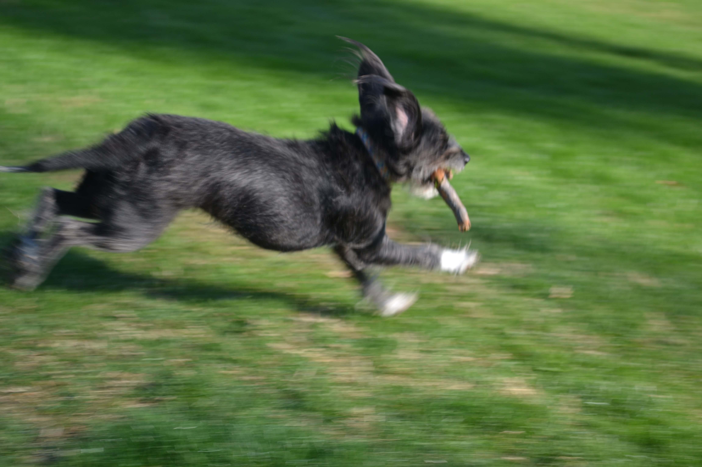
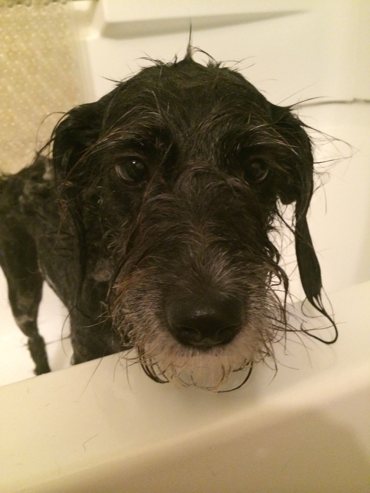
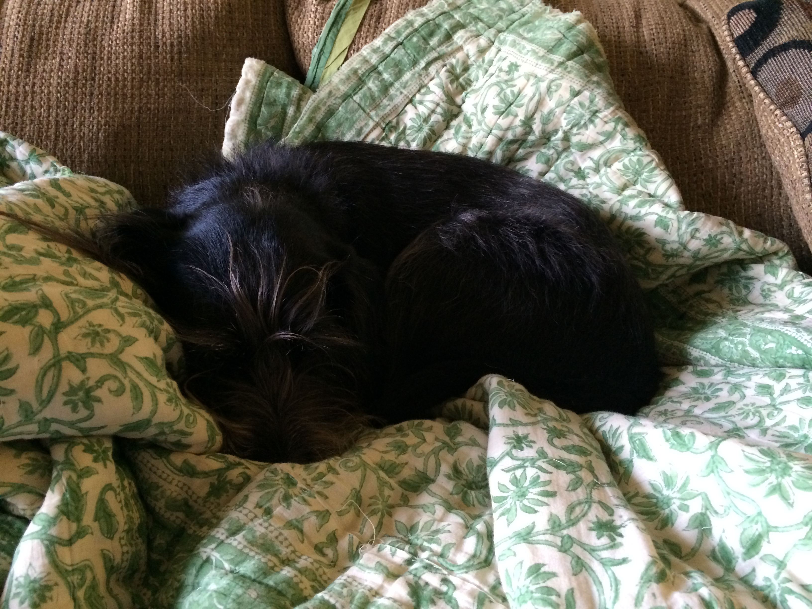

Daisy
========

(Spine)

Daisy

-----------------------

(Front Cover)

Daisy

A Book for Eddie

-----------------

Who's the dog with the shiny nose,

-------------------

with so big and pink a tongue,

-------------------

and fluffy paws with fluffy toes,

-------------------

a tail that wags for fun?

-------------------

It's Daisy!

-------------------

She went to school and now she's smart.

-------------------

She chases rabbits in the sun.

-------------------

She makes digging holes an art,

-------------------

and fetches sticks for fun.

-------------------

She can do a silly dance,

-------------------

and loves the beach a bunch,

-------------------

and if you give her half a chance,  
she'll eat up half your lunch!

-------------------

When she's mucky as a stray,  
into the bath she'll leap,

-------------------

and when she's all done with her day,  
she loves a good long sleep.

-------------------

(Back Cover)
